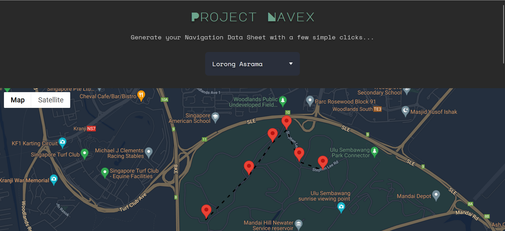
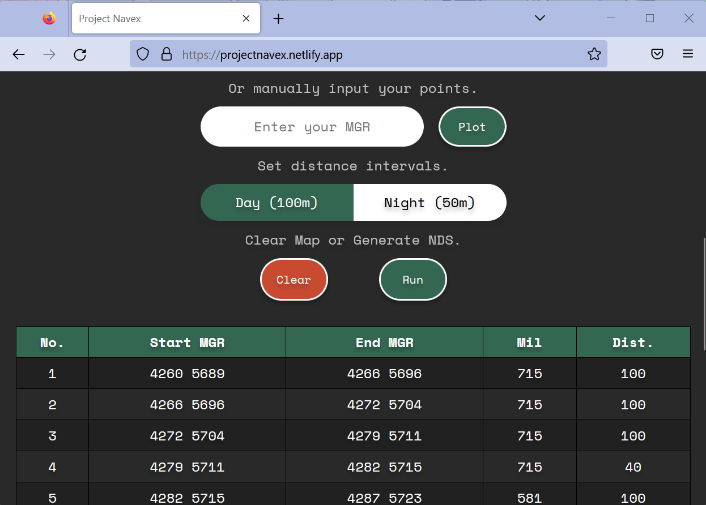

# Project Navex

## Description

We wanted to create a web application that allows the user to plot their navex checkpoints on Google Maps instantly get a navigational data sheet (NDS). The NDS contains a list of points separated by 50m or 100m from one checkpoint to the next.

### APIs Used

* [Google Maps Javascript API](https://developers.google.com/maps/documentation/javascript) - Used to generate map and checkpoints.
* [ESPG.io](https://github.com/maptiler/epsg.io) - Used to convert coordinates from latlng to Kertau (RSO).

## Features

1. Choose your training area from a dropdown menu.
2. Choose either roadmap or satellite view for the map.
3. Plot your checkpoints anywhere within Singapore.
4. Edit your route by dragging checkpoints around, or deleting them.
5. Manually enter and plot your own checkpoints in Kertau RSO coordinate format.
6. Choose between 50m or 100m intervals between checkpoints.
7. If you are unhappy with your route, you can clear the entire map.
8. Click run to generate an NDS based on the checkpoints plotted on the map.
9. In the NDS, checkpoints will be yellow colored while sub-checkpoints white.

